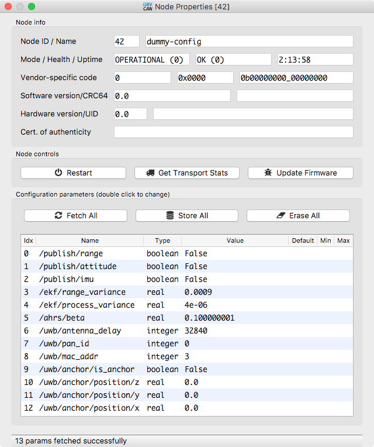

# Requirements

* A version of arm-none-eabi-gcc compatible with C++11 (Tested with GCC 5.4.1)
* Python 3.5 or greater
* [Packager](https://github.com/cvra/packager), a program used to manage dependencies
* [PyUAVCAN](https://github.com/UAVCAN/pyuavcan), which contains the code generator for UAVCAN
* OpenOCD 0.9.0 or greater
* CMake and [CppUTest](http://cpputest.github.io/) for running the unit tests.

# Quickstart

```
# Updates submodules if the repo was not cloned with --recursive
git submodule update --init --recursive

# Generates the build files
packager

# Creates C++ code from UAVCAN message definitions
make dsdlc

# Builds the project
make

# Uploads the project to target board
make flash
```

# Running unit tests

```
# Creates an empty directory to put the build files
mkdir -p build && cd build

# Configures the build environment
cmake ..

# Compiles and runs the tests
make check
```

If everything goes well, you should see a message saying something like `OK (174 tests, 174 ran, 1302 checks, 0 ignored, 0 filtered out, 53 ms)`.
If there are failures, the relevant line and files will be shown, so you can check them out.

# Board configuration

Once a board has been flashed, they must still be configured.
This can be done either using the USB or CAN interfaces (see below).
Changes done in one interface are automatically reflected on the other.

The minimum amount of configuration required is to give the board a unique MAC address, indicate wether it is an anchor or not, and give it a fixed position if it is an anchor.

## Via USB

The microUSB connection on the board emulates a serial port.
You can connect to it using your favorite serial terminal emulator.
The baudrate does not matter, as the simulated connection will accept any baudrate.
For example, using [PySerial](https://pythonhosted.org/pyserial/):

```
# The name of the port might be different on your computer!
python -m serial.tools.miniterm /dev/ttyUSB0 115200
```

Once connected, you can display the current parameters by running `config_tree`.
You can change parameters using `config_set`:

```
# Boolean parameters can be "true" or "false"
config_set /uwb/anchor/is_anchor false

# Scalar and integers parameters
config_set /uwb/pan_id 42
```

Once you are satisfied with the settings, store them to non volatile memory using `config_save`.
Otherwise, they will be lost on reboot.
To clear non volatile memory (which restores the default values for all parameters), run `config_erase` and reboot the device.

## Via CAN

If you have setup UAVCAN correctly, you should be able to run `uavcan_gui_tool`, which is a graphical tool used to interact with UAVCAN devices.
Please refer to [the tool's documentation](http://uavcan.org/GUI_Tool/Overview/) for details.
Once this is running, you can open a node properties by double clicking on the node.
You should see a screen similar to the one shown below.

{width=60%}

On this screen you can double click on a parameter to change its value.
Do not forget to click the "Send" button to apply your changes.

Once you are happy with your settings, save them to non-volatile memory by clicking the "Store All" button.
Clicking the "Erase all" button will clear the non volatile memory, restoring all parameters to default values on next reboot.

## Parameter description

This is the parameter tree, along with default values.

```
publish: # Settings related to the publication of data over UAVCAN
  range: false # Publish raw range measurements
  attitude: false # Publish attitude quaternion
  imu: false # Publish raw IMU measurements
ekf: # Settings related to the Kalman filter
  range_variance: 0.0009 # Variance of the range measurement
  process_variance: 0.000004 #
ahrs: # Parameters for the attitude (AHRS) algorithm
  beta: 0.1 # Madgwick gain
uwb: # Parameters for the radio module
  antenna_delay: 32840 # Antenna delay, calibrated for this board
  pan_id: 0 # PAN (network) ID. All boards must be in the same PAN
  mac_addr: 0 # Mac address. Must be unique per board in a given PAN
  anchor:
    is_anchor: false # Indicates if this board is a beacon or an anchor
    # Position of this anchor in the shared frame.
    # Ignored if is_anchor is false.
    position:
      z: 0.
      y: 0.
      x: 0.
```
