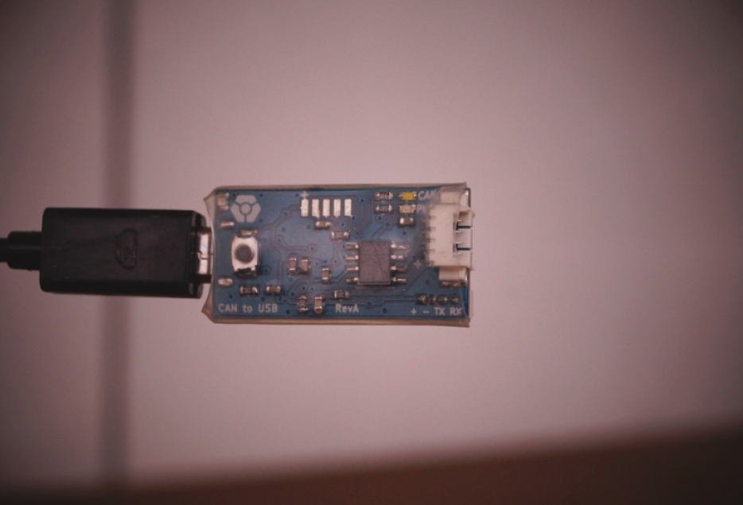

# CVRA's Robotics CAN Ecosystem

An open-source panoply of UAVCAN connected boards to enable smart sensors and actuators for modular robotics development

    

        <a href="./motor.html">
            
            

                
Motor board

            

        </a>
    

    

        <a href="./io.html">
            
            

                
IO board

            

        </a>
    

    

        <a href="./sensor.html">
            
            

                
Sensor board

            

        </a>
    

    

        <a href="./beacon.html">
            
            

                
Beacon board

            

        </a>
    

    

        <a href="./adapter.html">
            
            

                
CAN adapter

            

        </a>
    

    

        <a href="./bootloader.html">
            
            

                
CAN bootloader

            

        </a>
    

