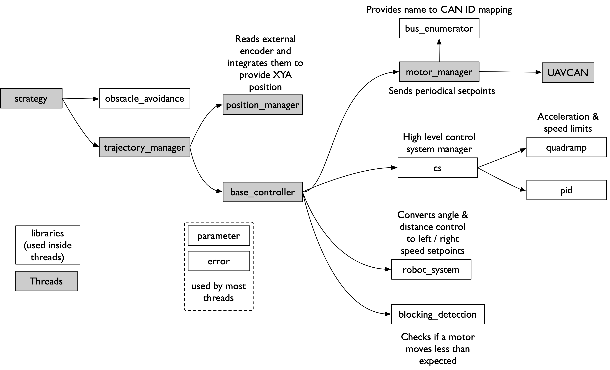

---
freshness:
  - owner: antoinealb
    reviewed: 2020-12-26
---

## Life of a movement

The game AI says `goto(1500mm, 1500mm)`.
What happens next?

1. The strategy uses the `obstacle_avoidance` to compute a path that intersect no obstacles.
1. The strategy gives the first point to `trajectory_manager`, which computes an angle and a distance to reach that point.
    To do so, it asks the `position_manager` what the current position of the robot is.
1. The angle and distance are used as setpoint for the `base_controller` control systems.
    They are first filtered through a quadramp to limit angular/linear velocities & accelerations.
    Then, `robot_system` computes the current angular and linear positions by reading encoders position from hardware and summing/subtracting them.
    Those current positions and desired filtered position are used as inputs for the PIDs, who give back angular & linear speeds.
    `robot_system` is used again, to convert those to left and right wheel speeds.
    The left and right wheel are sent to `motor_manager`, which stores the required velocity for each motor board.
1. Periodically, `motor_manager` sends to the left and right motor boards the new speed setpoints.
    It must first convert the names of the board to CAN IDs by reading the mapping stored by the `bus_enumerator` on the boot of the robot.
1. The motor boards apply this new speed setpoints to the wheels using their internal control, which causes the robot to move.
    This moves the external encoders wheels, which send their positions to the master board using standard AB quadrature channels.
1. Periodically, `position_manager` reads the new encoders positions and computes the new (XY, angle) position of the robot.
1. The process starts over until the path is complete.
    For intermediate points, the strategy decides if it can move to the next waypoint by computing distance to the current point and comparing to a threshold.
    For the final point, `trajectory_manager` decides if he arrived by looking at whether the filtered angle and distance speeds are zero (meaning we are stopped).

## Useful references

* [Cours d'asservissement de RCVA, in French](https://www.rcva.fr/10-ans-dexperience/9/)
* [Microb Technology control system design, in French](https://wiki.droids-corp.org/articles/a/v/e/Aversive/Asservissement_Microb_2008.html).
    We are using most of their control system implementation (with some changes) so it is a good introduction on how to use our system.
