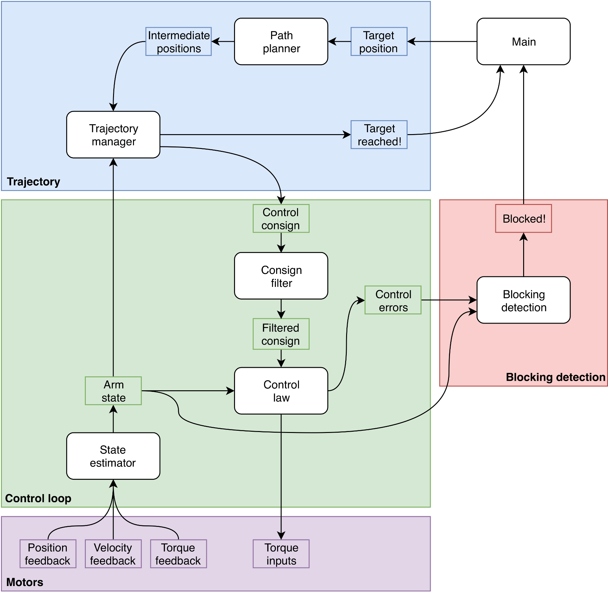

# Arm control system design

We want to achieve the following with our arm control system:

- Track the state (position, velocity, torque) of the arm
- Move the arm to desired positions while satisfying constraints:
    * Avoid obstacles
    * Limit maximum velocity and torque on the joints
- Detect when the arm is blocked

For that, we'll get inspiration from [Mikrob technology's control system design in aversive](https://wiki.droids-corp.org/articles/a/v/e/Aversive/Asservissement_Microb_2008.html).
It provides us with a modular clean architecture that separates concerns properly.
The separate components can be composed to implement complex behavior, and some components are optional.
Here follows a diagram of the proposed design.

Each of the main blocks (motors, control loop, trajectory, and blocking detection) run in their own thread.
In the following, their respective role is described in more detail.

## Motors

The motors are interfaced over UAVCAN.
The current abstraction goes through `motor_driver` and `motor_manager` in `master-firmware`.
This allows us to:

- Gather feedback on the motors: we'll use position, velocity, torque
- Send setpoints to the motors: we'll use torque

This part already exists.

## Control loop

This block is broken down into three major components:

- State estimator
- Consign filter
- Control law

### State estimator

The state estimator is responsible for gathering sensor measurements (i.e. joint positions, velocities, and torques) and estimate the state of the arm.
The simplest possible state estimator only knows about the arm's kinematics and dynamics, such that it can convert from joint space to cartesian space, and viceversa.
A more elaborate state estimator can be a Kalman filter which attempts to model the presence of noise in the input joint measurements and filter it out.

### Consign filter

The consign filter is an optional block.
It takes a consign (desired target arm state) and smoothes it, usually in order to make it feasible.
It can be a limited acceleration filter (ramp) or a limited velocity filter (quadramp).

### Control law

The control law takes the estimated state (measurement) and the desired state (consign) and computes the control inputs that need to be applied to the physical system (the arm) in order to reach the desired state.
For a multi-joint arm, we can't use [PID](https://en.wikipedia.org/wiki/PID_controller) controllers, those are simple and sweet, but don't account for axis coupling, they are SISO controllers (single input single output).
Therefore we need a MIMO controller (multiple input multiple output), one of which is the [LQR](https://en.wikipedia.org/wiki/Linear%E2%80%93quadratic_regulator).
Fancier controllers can be found in the [MPC litterature](https://en.wikipedia.org/wiki/Model_predictive_control).

## Trajectory

This block as two major components:

- Trajectory manager
- Path planner

### Trajectory manager

The trajectory manager receives target positions and sends them to the control loop.
Then, it regularly polls the arm state to check if the target was reached (given a goal tolerance) to stop the control loop.
This prevents the arm from shaking when near its end goal.

### Path planner

The path planner is aware of the obstacles around the arm.
Thus, given a target position, it can compute the path circumventing obstacles and break it down into intermediate positions.
Intermediate positions are a discrete series of waypoints to follow.

## Blocking detection

The blocking detection thread will poll the arm state and monitor the control errors (difference between current state and desired state).
Based on settings, it will alert us when the arm is blocked.
